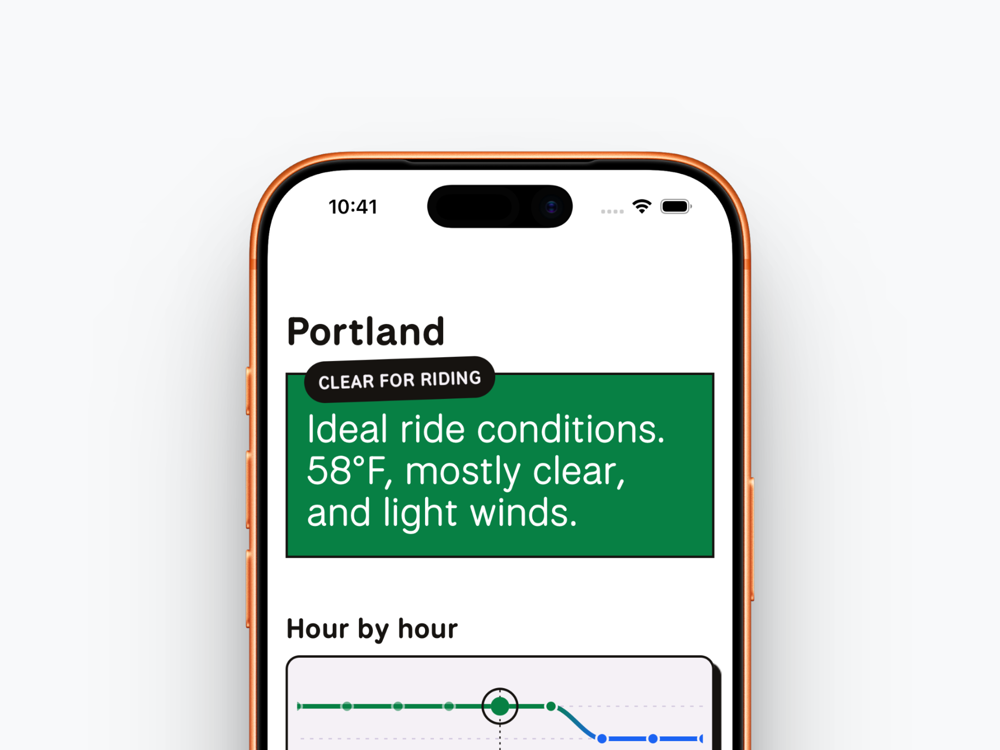
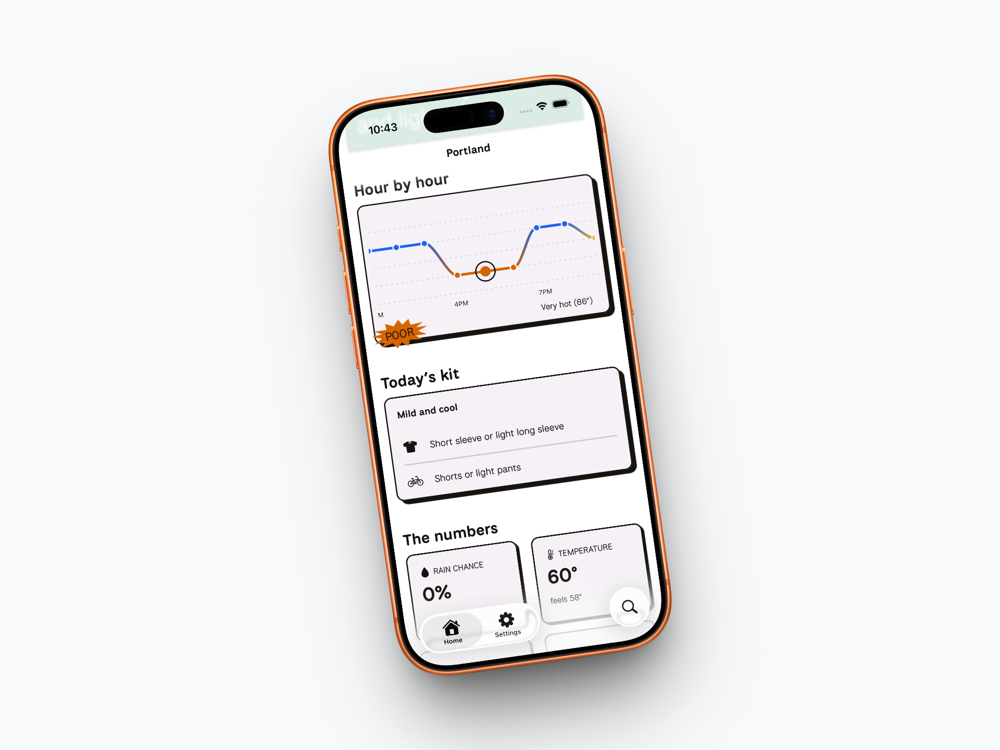

# Wheely Weather

[](https://opensource.org/licenses/MIT)
[](https://github.com/noahzm/wheely-weather/actions)
[](https://expo.dev/)

Wheely Weather scores how good conditions are for a bike ride. It's an [Expo Router](https://docs.expo.dev/router/introduction) app for iOS, Android, and web, live at [wheelyweather.app](https://wheelyweather.app).

The look is a layered system: a flat theme background, liquid-glass chrome (`expo-glass-effect`), neobrutalist `BrutalCard` content surfaces, and the National Park typeface.

## Features

- 🚴‍♂️ **Custom scoring algorithm** for cycling conditions
- 👕 **Dynamic kit recommendations** based on temperature and wind
- 📈 **Hourly micro-forecasts** and interactive charting
- 📱 **Cross-platform** support for iOS, Android, and Web

## Screenshots




## Getting started

### Prerequisites

- Node.js (LTS recommended)
- npm or yarn

### Installation

```bash
npm install
```

| Command                                           | Description                                               |
| ------------------------------------------------- | --------------------------------------------------------- |
| `npm run web` / `npm run ios` / `npm run android` | Run the app                                               |
| `npm run storybook:web`                           | Component workshop at http://localhost:6006               |
| `npm run build:web`                               | Export the web build (`expo export --platform web`)       |
| `npm run deploy:web`                              | Build then deploy the web build via Wrangler (Cloudflare) |

## Quality gates

Mirrors CI (`.github/workflows/ci.yml`), run in this order:

```bash
npm run format:check
npm run lint
npx tsc --noEmit
npm test
npm run build:web
```

`npm run test:e2e` (Playwright against Storybook) and `npm run test:e2e:app` (Playwright against the exported web app) aren't part of CI and are run manually.

## Architecture

For the full architecture, conventions, and toolchain constraints, see [`CLAUDE.md`](./CLAUDE.md).

## License

MIT — see [`LICENSE`](./LICENSE).
