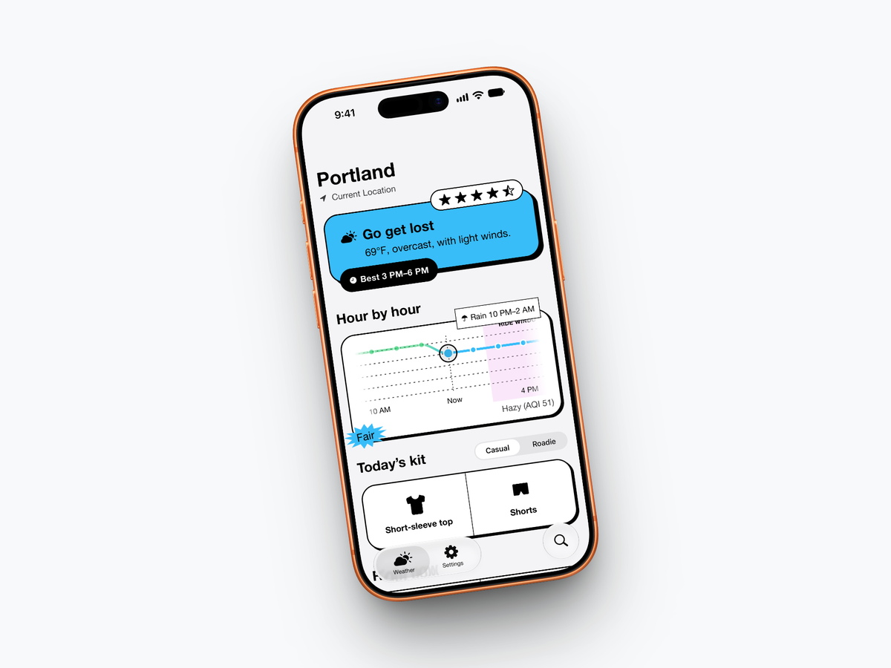
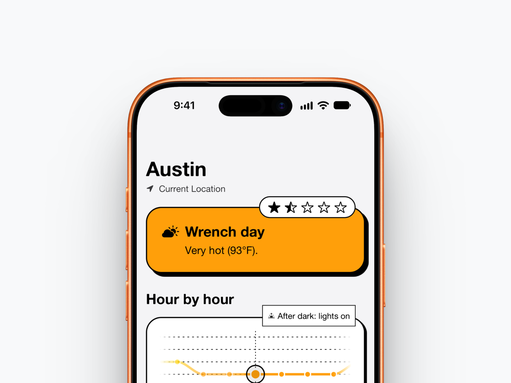

# Wheely Weather

[](https://opensource.org/licenses/MIT)
[](https://github.com/noahzm/wheely-weather/actions)
[](https://expo.dev/)

Wheely Weather scores how good conditions are for a bike ride, live at [wheelyweather.app](https://wheelyweather.app). It's an [Expo Router](https://docs.expo.dev/router/introduction) app for iOS, Android, and web with a liquid-glass, neobrutalist aesthetic.

## Features

- 🚴 **Intelligent Ride Scoring** — Evaluates temperature, "feels like", wind speed & gusts, rain probability & precipitation, dew point, AQI, UV index, and daylight to give an immediate ride verdict (Ideal, Good, Fair, Poor, Don't Ride).
- 🧠 **Climate Acclimatization** — Contextualizes temperature thresholds against your home climate baseline so seasonal shifts feel natural.
- 👕 **Dynamic Kit Recommendations** — Suggests specific cycling gear and layers (jerseys, jackets, base layers, bibs, gloves, eyewear) based on real-time weather and personal gear style preferences (Warm, Neutral, Cool).
- 📈 **Hourly & Multi-Day Forecasts** — Interactive hourly score chart with condition stickers and a multi-day outlook to plan upcoming rides.
- 📍 **Pinned Locations & Fast Search** — Save favorite riding spots with a quick-switch pinned bar and instant location geocoding.
- ⚠️ **Weather & Hazard Alerts** — Surfaces real-time severe weather warnings and atmospheric hazards.
- 📱 **Cross-Platform Native Fidelity** — Native Apple WeatherKit and Apple MapKit modules with liquid-glass styling on iOS; Open-Meteo with Cloudflare Worker proxy on Web & Android.

## Screenshots




## Tech Stack

- **Framework**: [Expo SDK 57](https://expo.dev/) + [Expo Router](https://docs.expo.dev/router/introduction) (React Native 0.86, React 19 with React Compiler enabled)
- **UI & Styling**: Neobrutalist + liquid-glass theme tokens (`useWheelyColors`), `expo-glass-effect`, `lucide-react-native`
- **Weather & Geocoding**:
  - **iOS**: Apple WeatherKit (`modules/apple-weatherkit`), Apple MapKit search (`modules/apple-location-search`)
  - **Web / Android**: Open-Meteo APIs, Nominatim geocoding proxied via Cloudflare Worker (`workers/index.mjs`)
- **Testing & Quality**: Vitest (unit & coverage), Playwright (E2E), ESLint 9 (type-aware), Prettier, TypeScript

## Getting Started

### Prerequisites

- [Node.js](https://nodejs.org/) (Node 24 LTS recommended)
- npm

### Installation

```bash
npm install
```

### Development Commands

| Command             | Description                                                                             |
| ------------------- | --------------------------------------------------------------------------------------- |
| `npm run web`       | Start the local web development server                                                  |
| `npm run ios`       | Build, install, and run the iOS development app                                         |
| `npm run ios:clean` | Clean native regeneration and run iOS build                                             |
| `npm run android`   | Run Android development build                                                           |
| `npm run build:web` | Export the static web build (`expo export --platform web`)                              |
| `npm run check`     | Run the full validation suite locally (format, lint, typecheck, unit tests, web export) |

## Quality Gates

Quality gates mirror CI (`.github/workflows/ci.yml`), executed in this order:

```bash
npm run format:check   # Prettier check
npm run lint           # ESLint with zero warnings allowed
npm run typecheck      # TypeScript compilation check (tsc --noEmit)
npm test               # Vitest unit test suite
npm run build:web      # Expo web export
```

- **Coverage**: Run `npm run test:coverage` to check unit test coverage thresholds.
- **E2E Testing**: Run `npm run test:e2e:app` for manual Playwright testing against the exported web build (requires `npm run build:web` first).

## Architecture & Contributing

- **Architecture & Task Playbooks**: Detailed architecture overview, platform resolution rules, and agent conventions live in [`AGENTS.md`](./AGENTS.md).
- **Contributing**: See [`CONTRIBUTING.md`](./CONTRIBUTING.md) for contribution workflow and guidelines.
- **Security**: See [`SECURITY.md`](./SECURITY.md) for vulnerability reporting.

## License

[MIT](./LICENSE)
